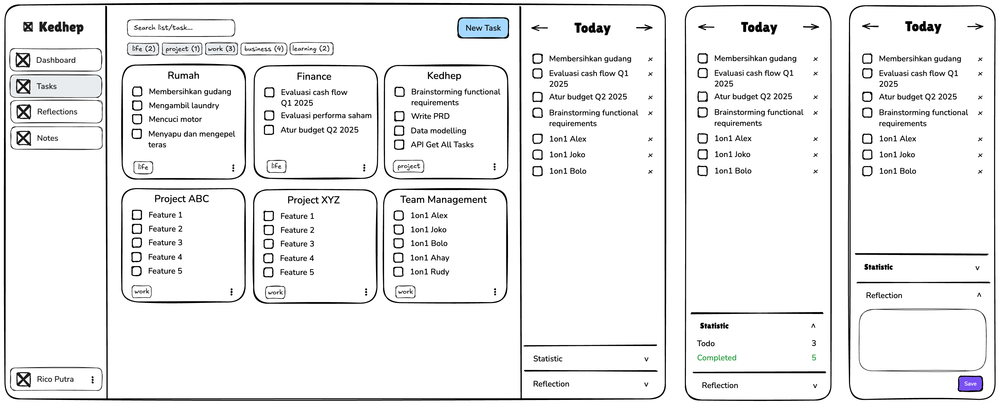
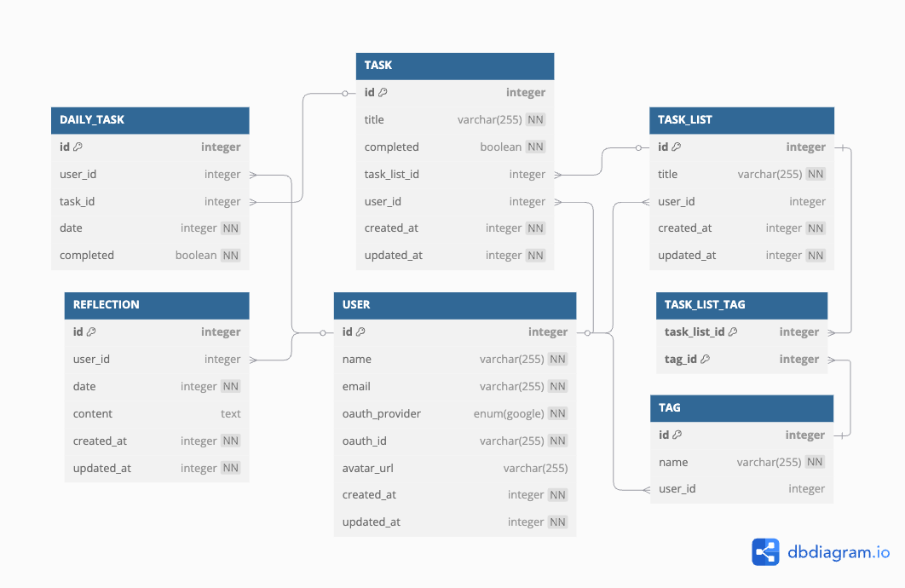

# 📋 Product Requirements Document (PRD) for Kedhep - Task Management Application

---

## 1. Overview

Kedhep is a category-based task management system designed to help users quickly regain focus and clarity amidst a sea of tasks. The name "Kedhep" comes from the Javanese word for "winking"—the idea is that with just a glance (or a wink) at the screen, you can instantly see all your tasks and easily choose which ones to focus on today.

This app was born out of a real personal need: as someone with many responsibilities and projects, it's easy to feel overwhelmed, lose track, and end up not finishing important work. Kedhep solves this by consolidating all your categorized tasks into one clear interface, making it effortless to:
- See everything you need to do
- Select your daily priorities
- Track your progress
- Reflect on your productivity

By providing an intuitive sidebar with task checkboxes, live statistics, and personal reflections, Kedhep offers a seamless, efficient workload overview and daily planning experience. It's designed for anyone who wants to streamline task management and boost productivity on a single screen—especially those who, like the creator, have struggled with task overload and confusion.

---

## 2. Functional Requirements & Features

### 2.1 Task List Management
- View all task lists as cards (e.g., Rumah, Finance)
- Filter task lists by tags (chips above grid)
- Search task lists by title (search input)
- Create, edit, and delete task lists
- Add, edit, delete, and toggle completion of task items
- Tag management for task lists (multi-select, filterable)

### 2.2 Daily Focus & Productivity
- View and manage a daily task list ("Today" section in sidebar)
- Add existing tasks to daily list
- Toggle completion and remove tasks from daily list
- Navigate between days (arrows)
- Live statistics: todo/completed counts (collapsible)
- Reflection note: write, edit, and save one note per day (collapsible)

### 2.3 Quick Task Creation
- "New Task" button (top right) opens modal
- Modal fields: Task List Title, Task Title, Tags (multi-select)
- On submit: create new list if needed, add task, associate tags

### 2.4 UI & Layout
- Sidebar: persistent navigation (Dashboard, Tasks, Reflections, Notes, Profile)
- Main content: responsive grid of task list cards
- Tag chips for filtering
- All actions accessible with minimal clicks

---

## 3. Data Model & Flow

- **Tables**: USER, TASK_LIST, TASK, TAG, TASK_LIST_TAG, DAILY_TASK, REFLECTION
- **Relationships**:
  - USER has many TASK_LIST, REFLECTION
  - TASK_LIST has many TASK, many TAG (via TASK_LIST_TAG)
  - TASK can be part of many DAILY_TASK
- **Key Flows**:
  - Task creation/management: CRUD on TASK_LIST, TASK, TAG, TASK_LIST_TAG
  - Daily focus: DAILY_TASK for per-day selection, completion, removal
  - Reflection: REFLECTION for daily notes
  - Statistics: Calculated from DAILY_TASK
  - Tag filtering: via TASK_LIST_TAG

---

## 4. Technical & UI Notes

- **Sidebar**: Persistent, with navigation, daily tasks, stats, reflection (collapsible)
- **Main Content**: Responsive grid of task list cards, tag chips for filtering, modal for new task
- **Interactions**: Minimal clicks, keyboard accessible, smooth animation for collapsible panels
- **Responsiveness**: Adapts to screen sizes, handles overflow
- **Data Consistency**: All updates reflect across UI and DB

---

## 5. Priorities & Risks

| Feature                      | Priority | Notes                                             |
|------------------------------|----------|---------------------------------------------------|
| Sidebar with Daily Task List  | High     | Day navigation, checkboxes, removal, task grouping |
| Collapsible Stats & Reflection| Medium   | Collapsible sections with accurate data and save   |
| Task Cards Grid & Filters     | High     | Category grouping, multi-tag filter chips          |
| New Task Modal               | High     | Create tasks with filtering tags                  |
| Navigation Sidebar           | Medium   | Basic navigation for Tasks, Notes, Profile         |

**Risks:**
- Data sync between daily and regular tasks
- UI responsiveness for sidebar/grid
- Collapsible section usability
- Data consistency across UI and DB

---

## 6. Risks & Considerations

- **Complexity in Managing Daily Lists:**
  - Must sync between `TASK`, `TASK_LIST`, and `DAILY_TASK` for accurate daily view.
- **UI Responsiveness:**
  - Sidebar and grid must adapt to various screen sizes and overflow scenarios.
- **Collapsible Sections Usability:**
  - Use clear visual cues and smooth animation for collapsible panels.
- **Data Consistency:**
  - Ensure updates to tasks/lists/tags reflect across all relevant UI and DB tables.

---

## 7. Summary

Kedhep is a category-based task management system focused on daily productivity, statistics, and reflection. The sidebar and main content are tightly integrated, and all features are mapped to clear DB structures. The UI is designed for clarity, speed, and flexibility, supporting both power users and casual task managers.

