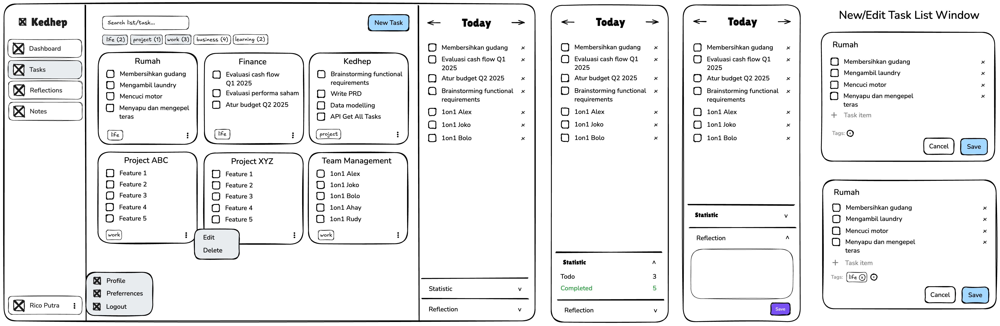

# Kedhep Task Breakdown

This document breaks down the main tasks required to design and implement the Kedhep task management application, based on the PRD.

---

## A. Tasks

### 1. Configuration
- [ ] Setup DB
- [ ] Setup docker-compose
- [ ] Setup Caddyfile
- [ ] Deploy to server
- [ ] Setup CI/CD pipeline
- [ ] Setup Sentry for error tracking
- [ ] Setup logging (e.g., Winston, Morgan)
- [ ] Setup monitoring (e.g., Prometheus, Grafana)

### 2. Sidebar
- [x] Show nav menu items in the sidebar
- [ ] Enable show/hide sidebar functionality
- [x] Implement navigation to all pages
- [x] Show user profile in the bottom section
- [ ] Show pop-up menu on user profile click
  - [ ] Navigate to Profile page when the user clicks on the Profile menu item
  - [ ] Show Preferences Window when the user clicks on the Preferences menu item
  - [ ] Execute Logout when the user clicks on the Logout menu item
  - [ ] Action: implement logout functionality
    - [ ] Clear user session
    - [ ] Redirect to login page

### 3. Task List (Card)
- [x] `UI`: Show all task items (with checkbox) in the list as a card
- [ ] `Action`: Toggle completion of a task item
- [ ] `UI`: Show the associated tags as chips on the card footer
- [ ] `UI`: Show a popup menu when the user clicks on the three dots in the top right corner of the task list card
  - [ ] `Action`: Edit - open the Edit Task List Window
  - [ ] `Action`: Delete - remove the task list

### 4. Tasks Grid
- [x] `UI`: Show all task lists as cards
- [x] `Action`: Get All Tasks (including the task items and tags in each task list)
- [ ] `UI`: Show all tags as chips above the grid
- [ ] `Action`: Filter tasks by tag
- [ ] `UI`: Show search input to search task lists by title
- [ ] `Action`: Search task lists by title

### 5. New/Edit Task Modal
- [ ] `UI`: Show "New Task" button in the top right corner
- [ ] `UI`: Show the New Task Modal when the user clicks on the "New Task" button
- [ ] `UI`: Show the Edit Task Modal when the user clicks on the Edit button in the task list popup menu
- [ ] `Action`: Create a new task list
- [ ] `UI`: Add a new task item to the task list
- [ ] `UI`: Edit the task list title
- [ ] `UI`: Edit the task item title
- [ ] `UI`: Delete a task item in the task list
- [ ] `UI`: Set tags for the task list
- [ ] `UI`: Toggle the task item completion status

### 6. Daily Tasks
- [ ] `UI`: Show all daily tasks for the current day in the right sidebar
- [ ] `Action`: Get all daily tasks by date
- [ ] `UI`: Add a task item from the task list to the daily tasks
- [ ] `Action`: Add a task item to the daily tasks
- [ ] `Action`: Toggle completion of a daily task item
- [ ] `Action`: Remove a daily task item
- [ ] `UI`: Enable to show/hide the daily tasks section

### 7. Daily Reflection
- [ ] `UI`: Show the daily reflection note in the right sidebar as a collapsible section
- [ ] `Action`: Get the daily reflection note by date
- [ ] `UI`: Show the reflection note input field
- [ ] `Action`: Save a reflection note for the current day

### 8. Statistics
- [ ] `UI`: Show live statistics in the right sidebar as a collapsible section
- [ ] `Action`: Calculate todo/completed counts for the current day

---

## B. Future Enhancements
- Database design & optimization (indexing, query performance)
- Caching strategy yang tepat
- Message queues & async processing (INI PENTING BANGET!)
- Rate limiting & throttling
- Monitoring & logging yang proper
- Database connection pooling
- Containerization (Docker, etc.)
- CI/CD pipeline
- Cloud services integration
- Infrastructure as Code
- Microservices architecture
- Event-driven architecture